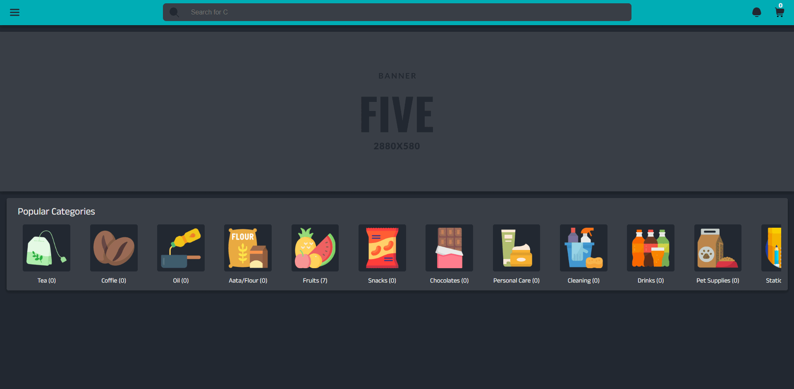
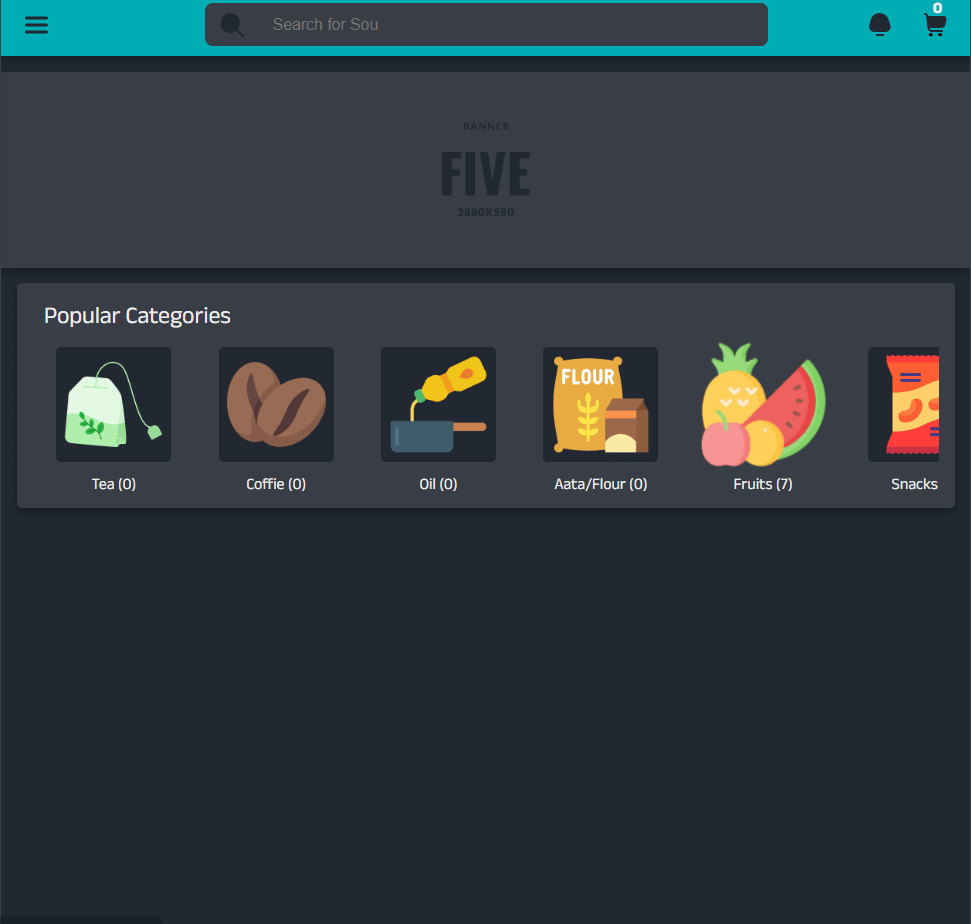

# Food Store Web Application

This is a simple food store web application where users can browse different sections, add fruits to their cart, update quantities, delete items, and place orders. After placing an order, users receive a sample text receipt.

## Features

- Browse multiple sections (currently data is only added in the fruit section).
- Add fruits to the cart.
- Update quantities of fruits in the cart.
- Delete items from the cart.
- Place an order and receive a sample text receipt.

## Screenshots

Here are some screenshots of the application:

### Preview - 01

### Preview - 02

